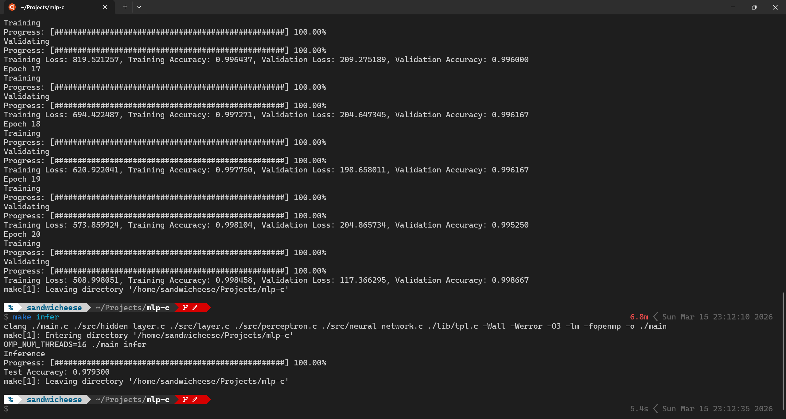

# Multi Layer Perceptron from Scratch in C

A bare-metal implementation of a fully-connected neural network in C with no ML libraries and no frameworks. Every component (forward pass, backpropagation, weight initialization, serialization) is implemented from scratch.

Trained and evaluated on [MNIST](http://yann.lecun.com/exdb/mnist/), achieving **97.93% test accuracy**.

## Results



- Epoch 20 — Training Accuracy: **99.85%**, Validation Accuracy: **99.87%**
- Test Accuracy: **97.93%**

## Architecture

| Layer    | Size | Activation | Init           |
| -------- | ---- | ---------- | -------------- |
| Input    | 784  | —          | —              |
| Hidden 1 | 512  | ReLU       | He             |
| Hidden 2 | 256  | ReLU       | He             |
| Output   | 10   | Softmax    | Xavier uniform |

Loss: Categorical Cross-Entropy

## Features

- Forward pass and backpropagation implemented from scratch
- Activation functions: ReLU, Sigmoid, Tanh, Softmax
- Loss functions: MSE, MAE, Binary Cross-Entropy, Categorical Cross-Entropy
- Weight initialization: Uniform, Normal, He, Xavier uniform
- Training/validation split with per-epoch shuffle
- Model save/load via [tpl](https://troydhanson.github.io/tpl/) serialization
- Parallelized forward pass and backpropagation with OpenMP

## Usage

```bash
# Train and save weights to ./weights/best.tpl
make train

# Load weights and run inference on the MNIST test set
make infer
```

## Requirements

- `clang` (or `gcc`)
- OpenMP (`-fopenmp`)
- MNIST dataset files in the expected directory
